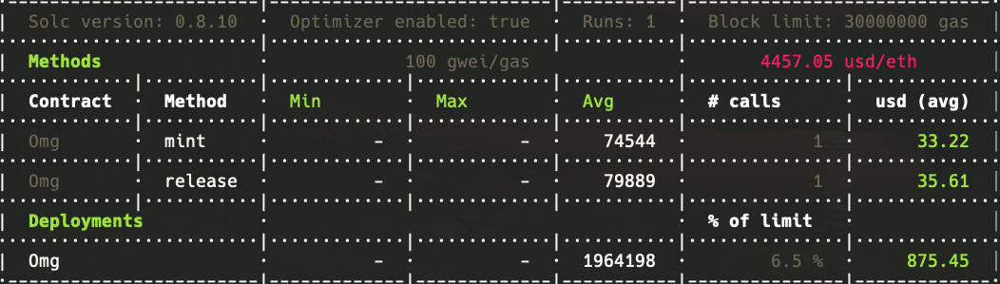

# ERC721Slim

Discussion:
<blockquote class="twitter-tweet">
How is <a href="https://twitter.com/PagziTech?ref_src=twsrc%5Etfw">@PagziTech</a> able to include ERC721Enumerable and still keep mint costs low for <a href="https://twitter.com/ToyBoogers?ref_src=twsrc%5Etfw">@ToyBoogers</a> ?   🧵
&mdash; Cache Monet | cachem.eth (@gaslimitreached) <a href="https://twitter.com/gaslimitreached/status/1463548142738153477?ref_src=twsrc%5Etfw">November 24, 2021</a></blockquote>

Enumerable implementation by PagziTech <https://pagzi.ca>

This implementation is untested. Do your own research and use at your own risk.

* `yarn`              install dependencies
* `yarn hardhat:test` includes gas estimate
* `yarn test`         includes test coverage

## Dependencies

Hardhat - Ethereum development environment.
<https://hardhat.org>

Hardhat gas reporter plugin.
<http://www.correccionesweb.com.ar/hardhat_vue/plugins/hardhat-gas-reporter.html>

_Optional_: Coin Market Cap API key for gas cost estimates.
Uncomment in `hardhat.config.js`
<https://pro.coinmarketcap.com>

## Contributing

Needs tests.
